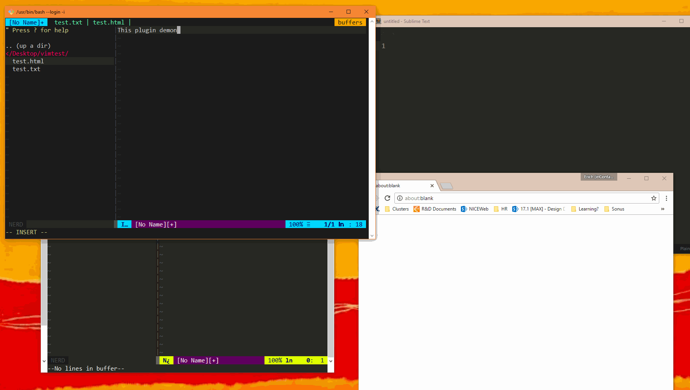

## `nerdtree-open-in-file-browser`

`nerdtree-open-in-file-browser` extends [Nerdtree](https://github.com/scrooloose/nerdtree) with the ability to open files with an application determined by your graphical file browser, independent of `vim`.

This plugin is forked from [aufgang001/vim-nerdtree_plugin_open](https://github.com/aufgang001/vim-nerdtree_plugin_open), and modified to use the abstraction layer I wrote for opening files. It should work out-of-the-box on more platforms, even on [Git Bash](https://git-scm.com/downloads) and [Cygwin](https://www.cygwin.com/).

## Install

My favorite is VimPlug:

```
Plug 'ErichDonGubler/nerdtree-open-in-file-browser' | Plug 'ErichDonGubler/vim-file-browser-integration'
```

## Usage

Demo GIF:



From NERDTree, select an arbitrary file or directory and press `E` to open it.

If it doesn't Simply Work, then file a bug for this plugin's dependency [`vim-file-browser-integration`](https://github.com/erichdongubler/vim-file-browser-integration).

